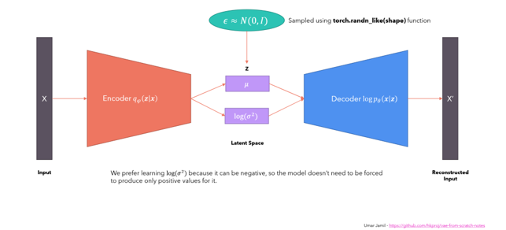

# ece285-project-lora-stablediffusion
“Course project for ECE 285: Fine-tuning Stable Diffusion with LoRA on chest X-ray datasets.”

# ECE 285 Project: Fine-tuning Stable Diffusion with LoRA for Chest X-ray Synthesis

## 📌 Project Objectives
- Fine-tune a text-conditional Latent Diffusion Model (LDM) to synthesize **high-fidelity chest X-ray images** controlled by domain-specific text prompts.  
- Evaluate the **quality, diversity, and realism** of generated synthetic images using metrics such as **FID (Fréchet Inception Distance)** and **IS (Inception Score)**.  
- Demonstrate the feasibility and value of **domain-adapted generative models** in addressing data scarcity and accelerating AI development in medical imaging.  

---

## 📖 Project Background
- Medical imaging datasets are often **restricted** due to the need for expert annotation, privacy regulations, and institutional data silos.  
- Data scarcity is especially severe for **rare pathologies** or nuanced clinical presentations, which limits robust AI model development.  
- **Latent Diffusion Models (LDMs)** can generate high-fidelity images, but off-the-shelf models trained on natural images struggle with the **specialized language and unique visuals** of medical imagery.  
- Fine-tuning diffusion models with **medical data and text** enables the generation of **synthetic datasets**, enriching rare/underrepresented cases and improving model robustness in a **safe, efficient, and scalable** way.  

---

## 🏗️ Model Architecture
This project fine-tunes **Stable Diffusion v1.5 (SD1.5)** with LoRA.  
The pipeline includes:  
- **Variational Autoencoder (VAE)**
  

  
- **Denoising U-Net Backbone**  
- **Text Conditioning via CLIP**  
- **Low-Rank Adaptation (LoRA)**  

---

## 📂 Dataset
**Chest X-rays (Indiana University)** from [Kaggle](https://www.kaggle.com/datasets/raddar/chest-xrays-indiana-university).  

- **Image Data**:  
  - 7,466 chest X-ray images (frontal & lateral views) with reports from 3,851 patients.  
  - Resized to **128 × 128** resolution due to memory constraints.  

- **Text Prompts**:  
  - Extracted from the **impression section** of radiology reports (summary of findings/interpretation).  
  - Excluded empty samples and reports >77 tokens (CLIP tokenizer limit).  
  - Final dataset: **7,281 unique image-text pairs**.  

- **Train/Test Split**:  
  - Training: **5,825 pairs (80%)**  
  - Testing: **1,456 pairs (20%)**  

---

## ⚙️ Fine-tuning Experiment
- Hardware: **NVIDIA P100 GPU** on Kaggle.  
- **LoRA-based fine-tuning** applied to the **U-Net** of Stable Diffusion.  
- Image resolution: **128 × 128**  
- Batch size: **4**  
- Other components kept **frozen**.  
- Pretrained weights: [`stable-diffusion-v1-5`](https://huggingface.co/runwayml/stable-diffusion-v1-5) from Hugging Face Hub.  
- Implementation: [🤗 Diffusers (v0.32.2)](https://github.com/huggingface/diffusers) and Hugging Face **LoRA training framework**.  

### Training Process
1. For each pair *(i, t)*, random Gaussian noise **Nᵢ,ₜ** is sampled in latent space.  
2. Noise is added to the latent representation of the image **Eᵥ(yₚₓₗ)**.  
3. The U-Net **ψ** processes the noisy latent + text embedding **Eₜ(xₜₑₓₜ)** to predict the noise.  
4. Loss = **MSE(Nᵢ,ₜ, N̂ᵢ,ₜ)** → used to update U-Net weights.  

---

## 📊 Results
### 🔧 Hyperparameter Settings
*(Details here, if available)*  

### 📉 Training Loss Curve
*(Insert figure here)*  

### 📈 Evaluation Metrics
- **Fréchet Inception Distance (FID)**: *(Insert value/plot)*  
- **Inception Score (IS)**: *(Insert value/plot)*  

### 🖼️ Image Comparisons
- **Generated vs Real (128 × 128)**  
*(Insert figure here)*  

- **Generated vs Real (512 × 512, upscaled)**  
*(Insert figure here)*  

---

## 📜 References
- [Stable Diffusion v1.5](https://huggingface.co/runwayml/stable-diffusion-v1-5)  
- [🤗 Diffusers Library](https://github.com/huggingface/diffusers)  
- [Kaggle Chest X-rays Dataset](https://www.kaggle.com/datasets/raddar/chest-xrays-indiana-university)  

---

## ✍️ Author
**Zhaowei Zhang (Zowie)**  
ECE 285, UC San Diego  
